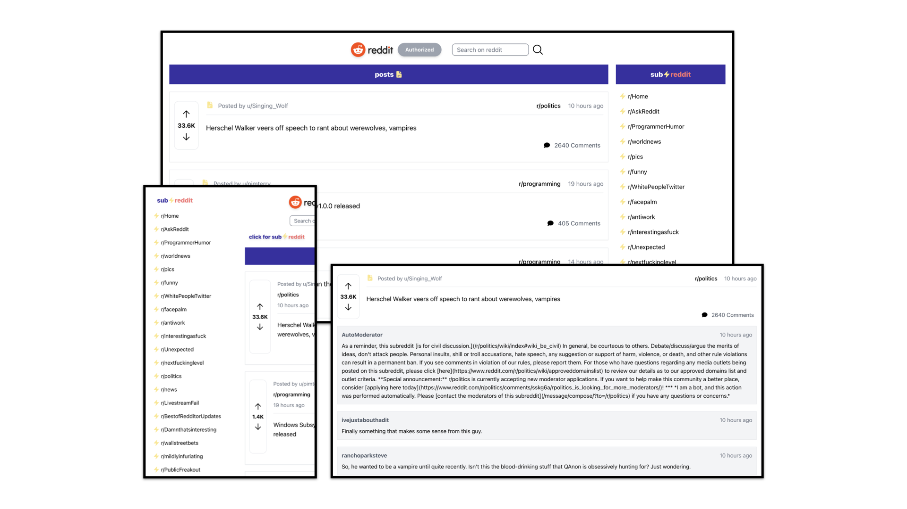

# Mini Reddit

### Read me first!
You may use VPN (if you are conveniently located in the blocked regions, i.e, Indonesia) to access reddit.com due to authorization process needed for experiencing [this project](https://bespoke-starburst-2c9e28.netlify.app/).

### Introduction
Hey folks, it's me again with another project. So, I have been working on this repo for almost 5 days now (definitely longer than my previous projects) and that is because I encountered ~*a difficult*~ an interesting couple of things along the way, such as writing an authorization module for obtaining access token from reddit's authorization server, so I could have an access to it's APIs. For that authorization module alone, I took a good amount of times to read and understand the [api documentation](https://www.reddit.com/dev/api/). Reddit API use OAuth2.0 protocol, therefore, if you guys inspired to replicate this project, here is [the article](https://medium.com/swlh/understanding-oauth-2-0-dc7ef422d915) to help you understand briefly about the protocol.

After I (presumably) done with the authorization module, I did not quite satisfy with the way I manage the API credentials and the obtained access token. With that being said, I looked again to my code and asked myself a question:

**_Does it okay to show the api credentials directly or is there a way to properly hide it? and if I show it directly, what would be the consequences?_**

and another one:

**_How to properly set and remove the obtained access token when user does log in and log out respectively?_**

### Researching for question's solution

**_Does it okay to show the api credentials directly or is there a way to properly hide it? and if I show it directly, what would be the consequences?_**

Turns out the consequnce could be **VERY COSTLY** and showing it directly **IS DEFINITELY NOT OKAY** such as the discussion in [this article](https://medium.com/@morgannegagne/a-very-expensive-aws-mistake-56a3334ed9ad). 

In the development phase:

I learned to create `.env` file in the root's project directory and that's where I put my API credentials. Then, insert the newly created `.env` file into `.gitignore` file, so the API credentials don't get into my github. I could access the API credentials through `process.env` object.

In the production phase:

I learned to use the platform's key management system. In this case, netlify.

### Project Screen Shots

